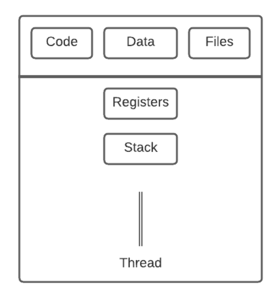
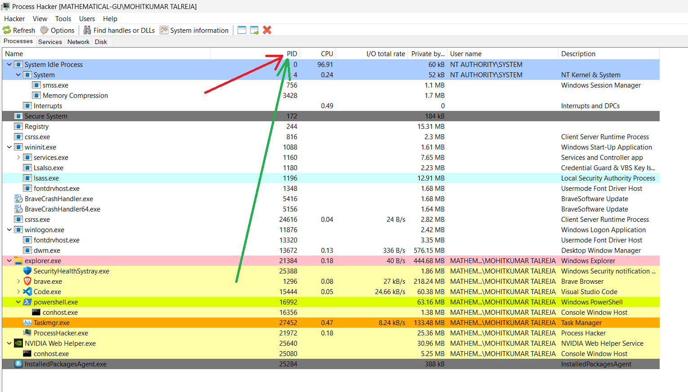
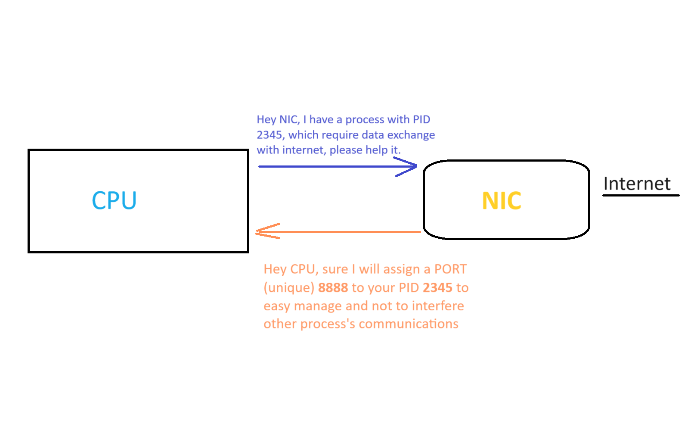
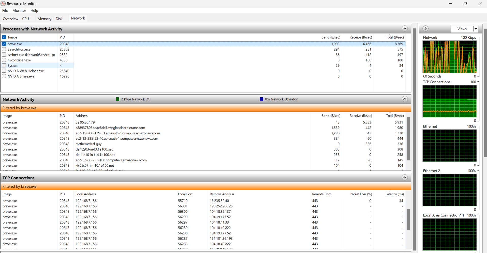
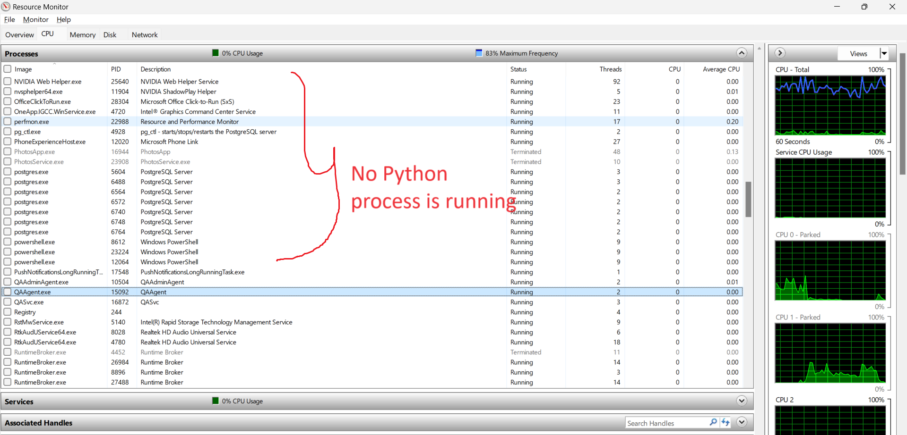
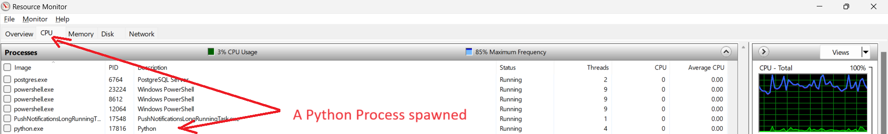
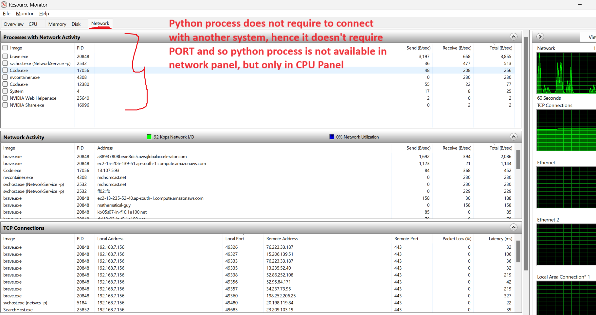
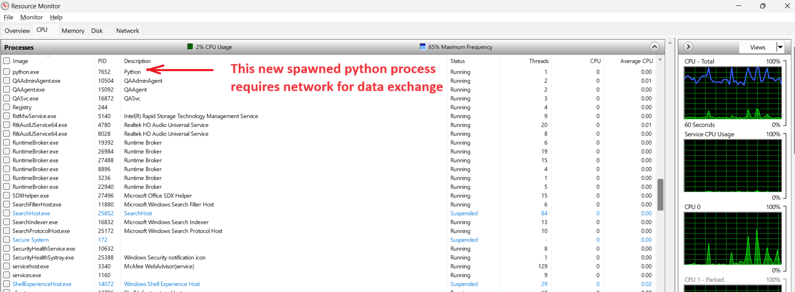
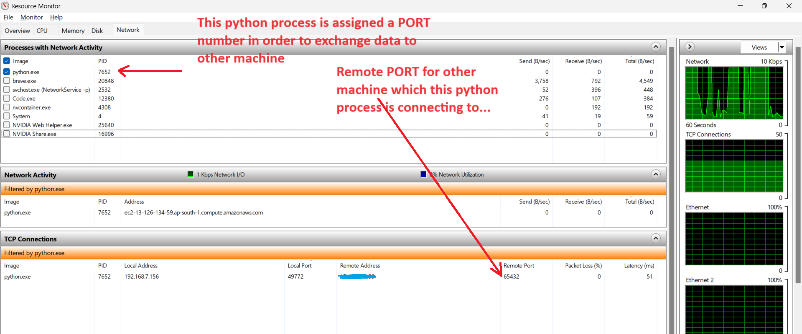
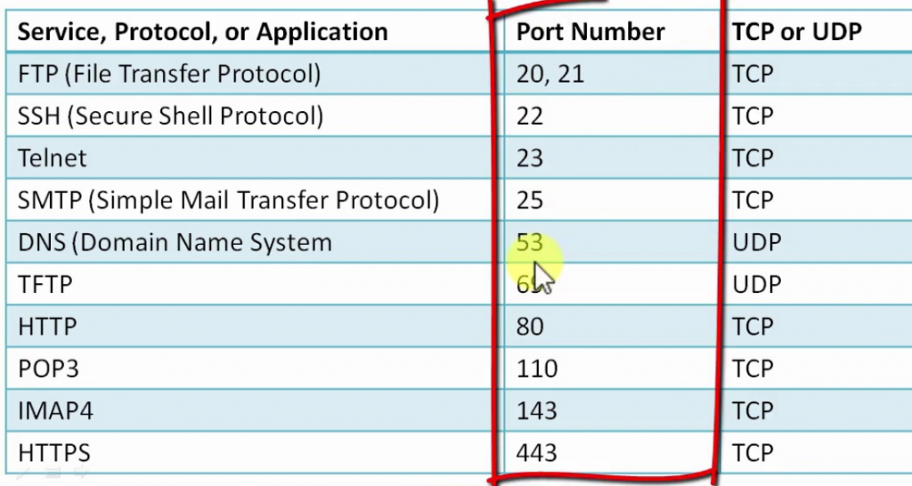

# Computer Network Ports Article

What are Computer Network ports ? How are the assigned ? Are they required ?

I will try to answer all of these question in the simple way possible way. But before that we have to understand What a Computer Process is ?
 
A process, in the simplest terms, is a running app (or program) [Source: Microsoft https://learn.microsoft.com/en-us/dotnet/api/system.diagnostics.process?view=net-8.0]

Suppose you have created a program irrespective of programming langugage (C/JS/Python/Java...). When you run the program (or app), the program executes as per the code written. Execution of program, require multiple things like:

 - Code                 (Written in your favourite programming language )
 - Data / Files         (User or File inputs 🤓)
 - CPU                  (Thinking ability 🧠)
 - Registers            (Temporary memory for execution)
 - Thread               (The Executor ☠️)
 - Stack                (Maintains function calls & variables )

Whenever you run code, a process is created which is executed. A computer can run many processes, depending upon the hardware you have RAM & CPU, there can be multiple factors, but for now these are two requirements for how many processes can be spawned up. If you run the program multiple times at the same time instant, multiple processes of same code (program) are executed. Such practices are used in daily practices for example in Web Application Server. Operating System (Windows/Linux) binds a unique identifier called Process Identifier (PID) with each process to manage the resources.
For Windows you can check PID of your applications through a tool called Process Hacker as 

As shown images, Brave browser (application) has a Process ID (1296), VS code has 15444 PID. Each PID or Process requires above mentioned things. More on process on some another article 😉😉.
Many of the processes require data exchange for which they might connect to other Computers/Servers etc.
Let's understand which hardware can help here.
 - CPU 🤔 It's require to process or making computations
 - RAM 🤔 It's for memory for variables 
 - NIC 😃 Yes, Network Interface Card, It is responsible for connecting your computer processes to network.

Consider an example, you are running following programs on your computer:
 - Surfing internet (or watching funny cat videos 😺) Chrome browser 
 - Listening to songs using spotify
 - Chatting with friends through Whatsapp web 
 - And many more programs ...

All of these programs are exchaging data through the internet. As the data is travelling in binary 00110... 🤓, it is hard to understand which binary data belongs to which process. It might be possible to interpret wrong by the process, or the program crashes. What if there exists a identifier like PID to tell which data is transfered to (or by) which process. That's is the "Network Port number" 😲. 

A Computer has 65536 ports available from 0 to 65535.
a. Well-known port (0-1023)
b. registered port (1024-49151),
c. dynamic port is three types of port number space. (49152-65535).

As you can see Brave browser is running on process 20848 (with multiple tabs) each assigned a local port as 55719, 56301, 56300 and many more.

I have created a main.py file which has two modes
1. Do some process which does not require network connection 
2. Do some process which require network connection

Before running you can see no process is listed in resource monitor

## 1. Do some process which does not require network connection
Python process is spawned and CPU assigns a PID 17816 as per below image 

 and No network PORT is assigned as per below image

## 2. Do some process which require network connection
A new Python process is spawned and CPU assigns a PID 7652 as per below image 

 and this process is assigned a PORT 49772 (local PORT) as per below image

The other machine (also called Remote Machine) to which this program is exchanging the data, also require a PORT (as that is also exchanging the data over the wire), and PORT assigned to that machine is 65432. 
This means that two programs are communicating over the internet and we should know the PORT number assigned to remote machine.
If we don't know it in advance while developing the client side program, there might be two scenarios possible
 - either we won't be able to connect
 - we will connect to wrong process of remote machine

Hence, PORTs are very essential to identify the process on the network. That's why many computer scientists when they developed their own protocols or programs like HTTP/SSH/FTP/Telnet etc, they have defined the PORT implicitly.

